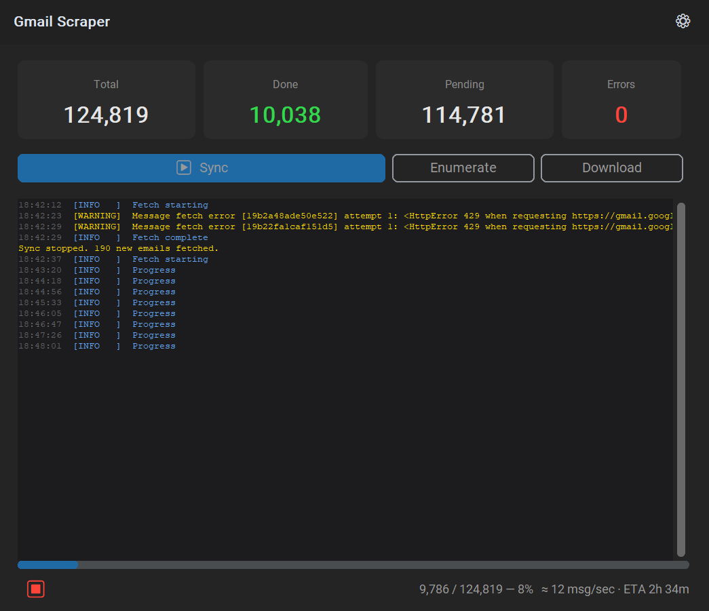

# Gmail Scraper

Bulk-export a Gmail account to a local SQLite database and sharded `.eml` files.



## Running from Source

Requires Python 3.12+. Start by cloning the repo.

You'll also need to follow [Setting up Google Integration](#setting-up-google-integration) below.

### GUI

Install dependencies:

```bash
pip install -e ".[gui]"
```

Run:

```bash
python gui_main.py
```

On first launch the app walks you through selecting the Google app credentials JSON and completing OAuth. After that it opens directly to the sync screen.

### CLI

Install dependencies:

```bash
pip install -e .
```

Authenticate once (opens a browser):

```bash
python bootstrap_auth.py
```

Then run the sync:

```bash
python -m gmail_scraper run
```

Or step by step:

```bash
python -m gmail_scraper enumerate   # Phase 1: index all message IDs
python -m gmail_scraper fetch       # Phase 2: download and store messages
python -m gmail_scraper status      # Check progress at any time
```

The sync is resumable — if it's interrupted, re-run `fetch` and it picks up where it left off.

### Backups

Data is written to `data/` in the repo root by default. To back it up:

```bash
tar -czf gmail-backup-$(date +%Y%m%d).tar.gz data/
```

---

## Setting up Google Integration

You need a Google Cloud project with the Gmail API enabled and an OAuth 2.0 credential to authenticate.

1. Go to the [Google Cloud Console](https://console.cloud.google.com/) and create a project (or select an existing one).
2. Navigate to *APIs & Services → Library*, search for **Gmail API**, and click **Enable**.
3. After enabling, click **Create Credentials**. The wizard will guide you through the process — select **OAuth client ID** when prompted.
4. Choose **Desktop app** as the application type. Give it any name and click **Create**.
5. Download the resulting JSON file and save it as `credentials.json`. The GUI will ask you to browse for it on first launch; for the CLI, place it at `data/config/credentials.json`.
6. Go to OAuth consent screen -> Audience -> Test users and add yourself.
Google may ask you to configure an OAuth consent screen before letting you create credentials. Set it to **Internal** if your Google account is part of a Workspace org, or **External** with yourself as a test user if it's a personal Gmail account.

---

## Development

```bash
pip install -e ".[dev,gui]"
pytest tests/
```
